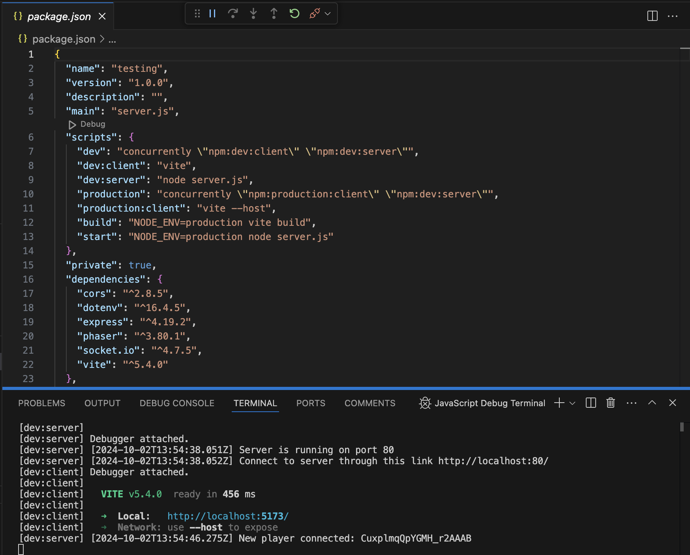
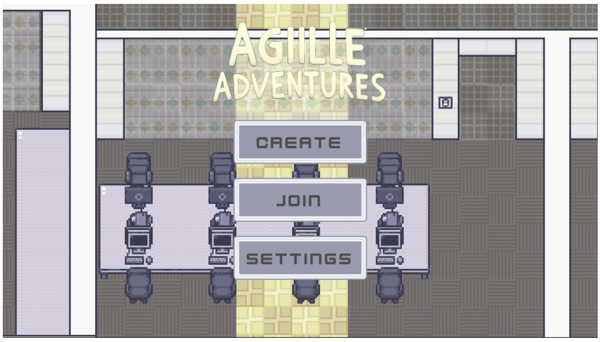
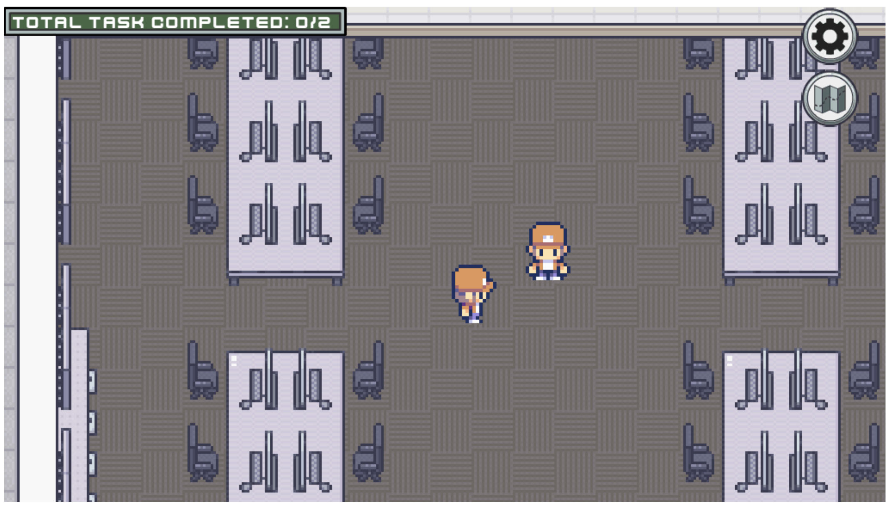
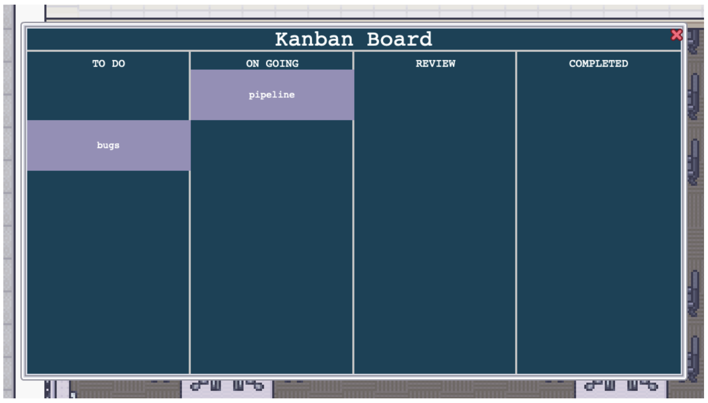
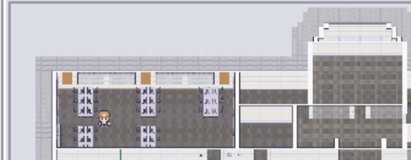
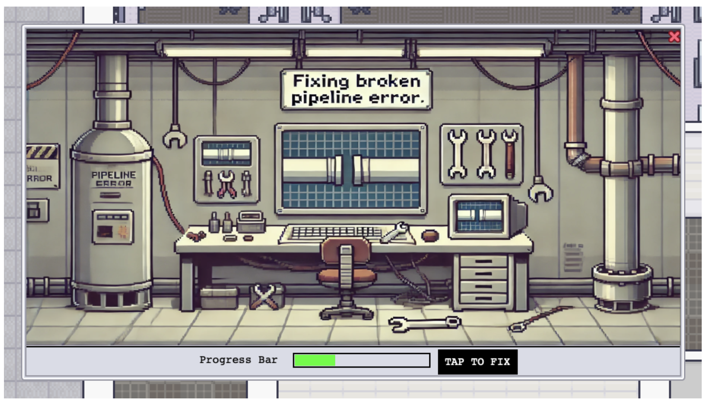
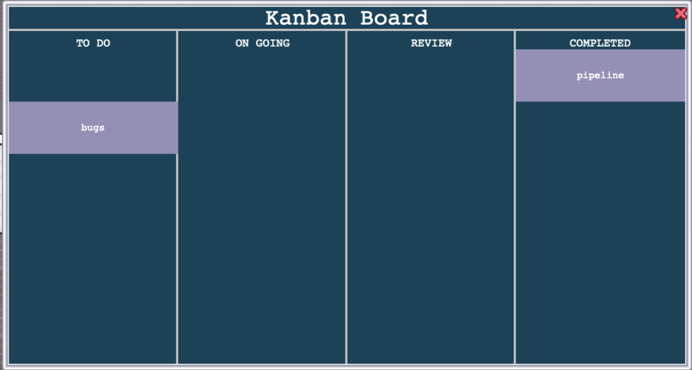

# Agile Adventures

## Project Motivation

Our group will make a multiplayer ‘Among Us’ inspired game where promotion and encouragement of the group to work together is vital to complete tasks. Tasks will be scattered across the map and are themed around software engineering. The game's purpose is to teach first year computer science and cybersecurity students on how to use Kanban boards effectively and as a unit. 

There will be an ECS lab map where up to five players will be able to freely move between areas to complete tasks. Some tasks will include: fixing pipeline error, load server, make project plan, make AND-OR-XOR Gates, review tasks. These tasks will be positioned on a Kanban board, where players will need to observe and interact with it to both find what tasks are to be done and what tasks are already completed.

## How to Run

1. Check if node is installed (need 22.8.0) -> node -v
1. Check if npm is installed -> npm -v
1. Check if you have nvm installed -> nvm -v
1. To install npm if not installed -> sudo apt install npm OR npm install
1. To install node if not installed -> nvm install 22.8.0, nvm use 22.8.0
1. Check node version to check 22.8.0 is installed -> node -v
1. To update after installed -> sudo apt-get update
1. Then to run open ./package.json and press run debug.
1. Once the drop down appeared after pressing debug select: "dev": "concurrently "npm:dev:client" "npm:dev:server""

## How to play

### Game Main Screen

1. If you are wanting to create your own room for your friends, select 'Create'. From here you can name your room in the pop-up. Once you have named your room press 'Ok' and this will transport you to your created room.
1. Other players can then join your room by selecting the 'Join', where they will be presented with a pop-up which will display available/playable game rooms. This can be refreshed by using the button in the top left of the pop-up.
1. To configure game settings that include ...

### How to play game

1. Players will be able to move around the map using their arrow keys. They will be able to participate with other team members by carrying out tasks, using the KanBan board, and further expanding their Agile understanding.
1. The top-right corner indicates how many tasks have currently been completed, so the players in the room can track their progress.

1. Players will interact with the kanban board by pressing the spacebar on their keyboard, where they will be presented with a pop-up. From here players will interact with the KanBan board to see what tasks are to be done, to update their progress on tasks, further their knowledge on how to use the KanBan board effectively on carrying out tasks, communicate with team-members on task progress, and further their progress in the game.

1. Players will be able to see where they are on the map and interact with tasks by pressing the map icon in the top-right corner of the screen. This will present a pop-up that continuously updates where the player is currently at on the map.

1. Players will carry out a number of tasks that they have to fix. Players will find tasks situated across the map that they will have to fix. Once they have successfully carried out the tasks it will be acknowledged as complete.

1. Once tasks have been completed players will update the KanBan board to indicate what tasks have progressed or have been successfully completed.
1. Once all tasks have been completed and have been successfully managed on the KanBan board the game is complete.